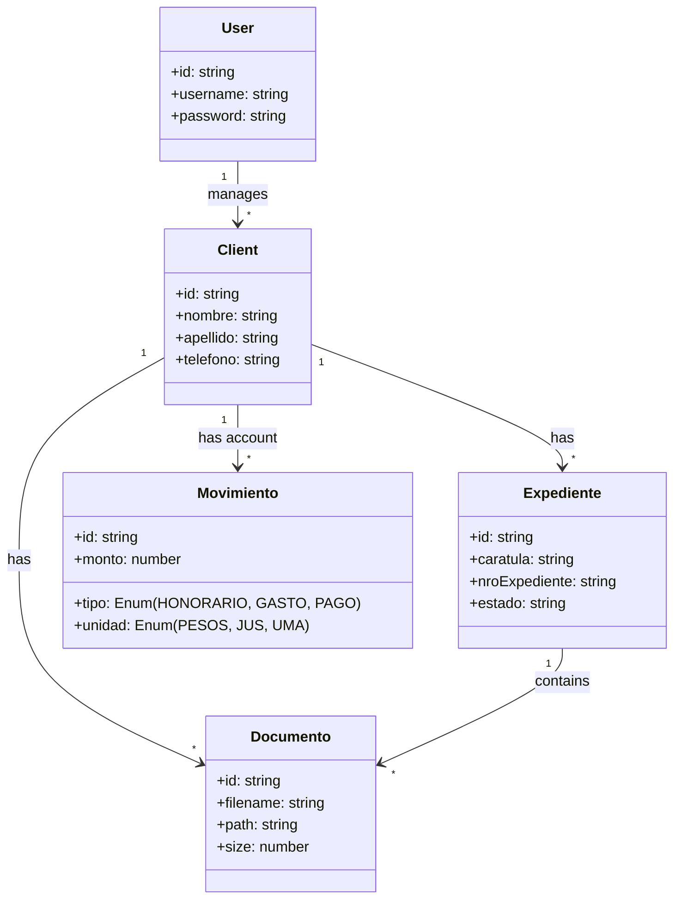

# ⚖️ LegalTech - Sistema de Gestión para Abogados

Bienvenido a **LegalTech**, una solución integral y moderna diseñada para simplificar la gestión de estudios jurídicos. Este sistema permite administrar clientes, expedientes, vencimientos, honorarios y documentos en un entorno centralizado, seguro y fácil de usar.

---

## 📘 Guía de Usuario (Para no programadores)

### ¿Qué puedo hacer con este sistema?

1.  **Tablero de Control (Dashboard)**:
    *   Al iniciar sesión, verás un resumen de tu estudio: Clientes activos, Expedientes en trámite, Vencimientos próximos y un Balance Financiero.
    *   Accesos rápidos para cargar nuevos datos inmediatamente.

2.  **Gestión de Clientes**:
    *   Crea fichas digitales completas con datos personales.
    *   Visualiza todos los expedientes y movimientos de cuenta asociados a cada cliente.
    *   Contáctalos directamente por WhatsApp con un solo clic.

3.  **Expedientes Jurídicos**:
    *   Registra causas con carátula, fuero, juzgado y estado procesal.
    *   Lleva un historial de movimientos ("Historia del Caso") para no perder detalle.
    *   Sube y organiza documentos (PDF, Word, Imágenes) directamente en el expediente.

4.  **Agenda y Vencimientos**:
    *   Nunca pierdas una fecha límite. El sistema te muestra alertas visuales (Semáforos) según la proximidad del vencimiento.
    *   Vista de calendario mensual para organizar tu mes.

5.  **Cuenta Corriente y Facturación**:
    *   Registra honorarios (en Pesos, JUS o UMA) y gastos.
    *   El sistema convierte automáticamente valores JUS/UMA a pesos según la configuración actual.
    *   Registra pagos a cuenta y visualiza el saldo deudor/acreedor de cada cliente automáticamente.

6.  **Gestor Documental**:
    *   Olvídate de buscar papeles. Sube escritos, cédulas y pruebas digitalizadas a cada carpeta de cliente o expediente.

### Primeros Pasos

1.  **Ingreso**: Accede al sistema con tu usuario y contraseña.
2.  **Configuración**: Ve a *Clientes > Cuenta Corriente > Configuración* para actualizar el valor del JUS y UMA.
3.  **Carga Inicial**:
    *   Ve a **Clientes** y botón **+ Nuevo**.
    *   Luego, dentro el cliente, crea su primer **Expediente**.
    *   Agrega **Vencimientos** importantes o adjunta **Documentos**.

---

## 🛠️ Guía Técnica (Para desarrolladores)

Este proyecto utiliza una arquitectura moderna de **Monorepo** separando Backend y Frontend.

### Stack Tecnológico

**Frontend (Client-Side)**
*   **Framework**: Angular 19 (Standalone Components, Signals).
*   **UI Library**: PrimeNG + Tailwind CSS (Diseño responsive y moderno).
*   **Gestión de Estado**: Angular Signals (Reactividad granular).
*   **Autenticación**: JWT (Interceptor HTTP).

**Backend (Server-Side)**
*   **Framework**: NestJS (Arquitectura modular, inyección de dependencias).
*   **Base de Datos**: PostgreSQL + TypeORM (Entidades y relaciones).
*   **Almacenamiento**: Local File System (con `multer` para subida de archivos).
*   **Autenticación**: Passport + JWT Strategy.
*   **Bot WhatsApp**: `whatsapp-web.js` (Automatización de mensajes).

### Estructura del Proyecto

```
/
├── backend/                # API REST NestJS
│   ├── src/
│   │   ├── auth/           # Login & JWT
│   │   ├── clients/        # Gestión de Clientes (CRUD)
│   │   ├── expedientes/    # Gestión de Casos
│   │   ├── documents/      # Gestor de Archivos (Multer)
│   │   ├── dashboard/      # Agregación de Estadísticas
│   │   ├── whatsapp/       # Servicio de Bot
│   │   └── ...
│   └── uploads/            # Almacenamiento físico de adjuntos
│
├── legal-tech-app/         # Frontend Angular
│   ├── src/app/
│   │   ├── core/           # Servicios, Guards, Interceptors, Modelos
│   │   ├── modules/        # Módulos Funcionales (Auth, Clientes, Expedientes)
│   │   ├── pages/          # Páginas principales (Dashboard, Calendario)
│   │   └── shared/         # Componentes reusables (UI Kit, Pipes)
```

### Modelo de Datos (Resumen)



### Despliegue Local

1.  **Requisitos**: Node.js v18+, PostgreSQL.
2.  **Base de Datos**: Crear base de datos `legal_tech`.
3.  **Backend**:
    ```bash
    cd backend
    npm install
    # Configurar .env con DB_HOST, DB_USER, etc.
    npm run start:dev
    ```
4.  **Frontend**:
    ```bash
    cd legal-tech-app
    npm install
    npm start
    ```
5.  **WhatsApp**: Al iniciar el backend, escanear el QR en la terminal para vincular el bot.

---
**Desarrollado con ❤️ por Antigravity**
